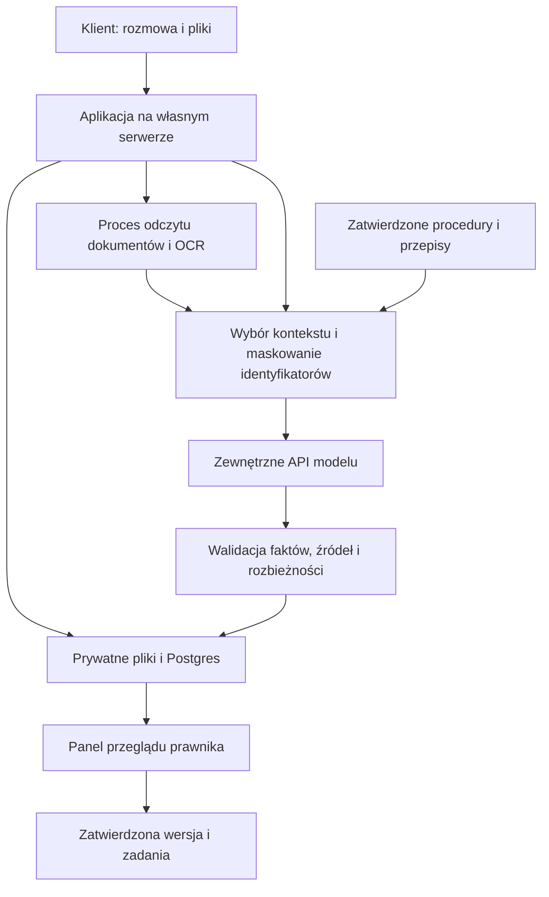

# Pełny bot do przyjmowania i porządkowania spraw

Plan z 2 października 2026 r. Cel: działająca aplikacja na serwerze użytkownika, model AI wyłącznie przez zewnętrzne API. Zbudowano pierwszą wersję pilotażową opisaną w README. Poniższy dokument zachowuje pierwotny zakres i historię etapów; aktualny stan znajduje się na końcu.

## Co oznacza pełny bot

Pierwsza kompletna wersja obsługuje proces od rozpoczęcia wywiadu do przeglądu danych, projektów dokumentów i zadań w panelu kancelarii. Rozmowy są rzeczywiste, dane trwałe, pliki przetwarzane, a dostęp chroniony kontami i rolami. Dokumenty demonstracyjne są zestawem testowym tego samego systemu, a nie odrębną odgrywaną aplikacją.

Pełna wersja nie oznacza automatycznej obsługi każdego rodzaju postępowania. Budujemy kompletne przyjęcie sprawy dla upadłości konsumenckiej i zgłoszeń firmowych z kontrolą danych. Przed użyciem w pracy kancelarii pytania, reguły merytoryczne i wzory zatwierdza prawnik. System nie podejmuje końcowej decyzji prawnej ani nie składa sam pism do sądu.

## Proces użytkownika

1. Klient otwiera bezpieczny link do zgłoszenia, zapoznaje się z informacją o przetwarzaniu danych i rozpoczyna rozmowę. Może wrócić do przerwanego wywiadu.
2. Bot ustala ścieżkę firmową lub konsumencką i zbiera informacje według konfiguracji kancelarii. Pyta o braki, pozwala poprawiać odpowiedzi i obsługuje prośbę o rozmowę z człowiekiem.
3. Klient dodaje dokumenty. Aplikacja odczytuje tekst, uruchamia OCR dla skanów i przedstawia dane do sprawdzenia.
4. Serwer porównuje informacje z rozmowy, dokumentów i opcjonalnych rejestrów. Pokazuje możliwe rozbieżności, kandydatów do powiązania zobowiązań i brakujące materiały.
5. Prawnik przegląda zgłoszenie, otwiera źródła i rozstrzyga kwestie niejasne. Potwierdza dane oraz ewentualne połączenie dokumentów dotyczących jednego roszczenia.
6. System tworzy kartę sprawy, listę zobowiązań i projekty z udostępnionych wzorów. Prawnik zatwierdza konkretną wersję.
7. Sprawa otrzymuje etap i zadania z przypisaniem do osoby. Terminy prawne wymagają potwierdzonej podstawy i daty rozpoczynającej ich bieg. Zwykłe terminy administracyjne mogą pochodzić z konfiguracji procesu.
8. Klient widzi listę rzeczy do uzupełnienia; kancelaria ma historię zmian i eksport danych.

## Moduły potrzebne do pierwszej kompletnej wersji

| Moduł | Wynik |
|---|---|
| Konta i dostęp | Role administrator/prawnik/pracownik, oddzielenie spraw i kancelarii, bezpieczne linki klienta |
| Wywiad AI | Polski czat, stan rozmowy, wznowienie, ekstrakcja i pytania o braki |
| Dokumenty | Upload, bezpieczne przechowywanie, tekst/OCR, strona i fragment źródła |
| Dane sprawy | Wierzyciele, zobowiązania, daty salda, kwoty, majątek, dochody i koszty |
| Kontrola | Różnice między źródłami, brakujące informacje, kandydaci podwójnego liczenia długu |
| Baza wiedzy | Zatwierdzone pytania, procedury, wzory; wybrane przepisy z datą wersji |
| Panel prawnika | Przegląd, korekty, potwierdzanie faktów, historia |
| Dokumenty wynikowe | Wersje, projekty na szablonach, zatwierdzenie, eksport |
| Etapy i zadania | Przejścia procesu, przypisanie, terminy, lista zaległości |
| Kontrola API | Dostawca, zakres przesłanych danych, limity, koszty, obsługa błędów |
| Utrzymanie | Kopie, test odtworzenia, migracje, monitoring bez treści klientów, usuwanie danych |

## Co zrobi wrażenie

Wyróżnik to sprawdzalna droga od źródła do zatwierdzonego dokumentu. Nie potrzebujemy twierdzić, że pokonaliśmy system, do którego nie mamy dostępu. Możemy pokazać konkretne wyniki:

- Ten sam dług opisany w trzech pismach nie zostaje trzykrotnie zsumowany bez ostrzeżenia i przeglądu.
- Różnice kwot uwzględniają datę salda, kapitał, odsetki i koszty; brakujące składniki pozostają nieznane.
- Kliknięcie pola otwiera właściwą wiadomość albo stronę dokumentu.
- Nowa wartość nie kasuje poprzednich źródeł; użytkownik widzi zmianę.
- Edycja po zatwierdzeniu tworzy nową wersję do przeglądu.
- Panel pokazuje rzeczywisty zakres danych przekazanych do API, zamiast ogólnego hasła o prywatności.

## Architektura

Propozycja: Next.js/TypeScript + Postgres/Drizzle + proces roboczy dla plików + HTTPS i Docker Compose. Model nie wymaga lokalnego GPU. System nie jest całkowicie lokalny, ponieważ wybrany kontekst jest przekazywany do API. RAG przechowujemy i przeszukujemy na serwerze; ewentualne embeddingi przez API również uwzględniamy jako transfer danych.

Dostawcę i model wybieramy na podstawie testów ekstrakcji języka polskiego, obsługi formatów, retencji i kosztu. Dokumentów nie wysyłamy w całości automatycznie, jeśli wystarczy wybrany tekst. Maskowanie identyfikatorów ogranicza ujawnianie, ale nie gwarantuje pełnej anonimizacji.

## Dane i integracje

Źródło podstawowe: rozmowy i dokumenty klienta oraz wzory dostarczone przez uprawnioną kancelarię. Publiczne przepisy: ELI/Sejm z kontrolą wersji. Dane firm: MF VAT i KRS, następnie REGON i CEIDG po uzyskaniu dostępu. KRZ nie blokuje kompletnego przyjęcia sprawy — jego bezpośrednią integrację dodamy po potwierdzeniu dokumentacji i dostępności.

Research i dokładne adresy: [ZRODLA-DANYCH-BOTA.md](ZRODLA-DANYCH-BOTA.md). Hipoteza działania Legal Flow, logika ekstrakcji, RAG i scenariusze: [PLAN-BOTA-API.md](PLAN-BOTA-API.md).

## Kolejność budowy

1. Model danych, konta, role i panel spraw. Najpierw poprawny zapis i dostęp.
2. Czat przez API, kontrolowany schemat ekstrakcji, wywiad konsumencki i firmowy.
3. Odczyt dokumentów oraz przypisywanie źródeł i wersji.
4. Rozbieżności, powiązania zobowiązań i kolejka pytań do klienta.
5. Zatwierdzane projekty dokumentów, etapy, zadania i portal uzupełnień.
6. Rejestry i zatwierdzona baza wiedzy; testy jakości, kosztów i uprawnień.
7. Wdrożenie na serwerze, próba odtworzenia kopii i pilotaż w ustalonym zakresie.

Na każdym etapie aplikacja pozostaje uruchamialna. Pełny cel jest osiągnięty dopiero po przejściu całego procesu i sprawdzeniu wymaganych funkcji, nie po samym uruchomieniu czatu.

## Dane potrzebne przed wykonaniem wdrożenia

System serwera, sposób uruchamiania kontenerów, parametry RAM/CPU/dysku, domena, sposób dostępu, wybrany docelowy dostawca API oraz limit wydatków. Użytkownik potwierdził API bez lokalnego LLM i dodał klucze OpenAI, Anthropic i DeepSeek do lokalnego `.env`. Pozostałe dane wdrożeniowe nie zostały jeszcze podane.

## Uzupełnienie: rekomendacje implementacyjne i dane testowe

[RESEARCH-I-REKOMENDACJE.md](RESEARCH-I-REKOMENDACJE.md) rozwija model faktów, chronologię kwot, mapowanie źródeł po maskowaniu danych oraz ochronę przed opóźnionym wynikiem zadania. Zawiera też dobór bibliotek z GitHuba i nowe źródła testowe MF/CEIDG. Ten dokument nadal określa docelowy pełny zakres bota.

Pierwsze [20 scenariuszy syntetycznych](tests/fixtures/cases.json) służy do budowy przyszłych testów ekstrakcji i procesu. Oczekiwania wymagają przeglądu, a testy OCR rzeczywistych obrazów i runner aplikacji pozostają do wykonania. Na etapie researchu nie wdrożono bota.

## Pierwszy wykonany moduł AI

Dodano adaptery ekstrakcji dla trzech dostawców, lokalną walidację faktów i źródeł, dokładne uzgodnienie kwot oraz runner na danych syntetycznych. Po poprawkach kontraktu wykonano udane próby C01/C07/C13 u wszystkich trzech dostawców i 14 lokalnych testów. Wyniki: [WYNIKI-TESTU-API.md](WYNIKI-TESTU-API.md). Jest to komponent do przyszłej aplikacji, bez panelu, bazy spraw, OCR i wdrożenia pełnego procesu.

## Panel testów i przygotowanie uruchomienia na VPS

Po pierwszym module dodano chroniony panel przeglądarkowy do 14 syntetycznych scenariuszy ekstrakcji. Backend nie przyjmuje swobodnych danych klientów, ogranicza liczbę żądań i zachowuje licznik po restarcie. Instrukcja i pliki systemd/nginx: [deploy/README.md](deploy/README.md). Testy modułu i serwera: 22/22. Ten panel udostępnia obecny moduł AI; nie realizuje jeszcze pełnego procesu opisanego powyżej.

## Aktualny pilotaż v1

Zbudowano konta i role, SQLite z wersjami i audytem, portal klienta, wywiad AI, upload i odczyt PDF/TXT/PNG/JPEG, OCR przez API, przegląd i korekty, kartotekę zobowiązań, rozbieżności, ręczne powiązania, pięć wzorów PDF, etapy, zadania oraz kopię z testem odtworzenia. Dodano odczyt KRS i MF VAT. Szczegóły: README, deploy/APP.md, WYNIKI-PELNEGO-PROCESU.md.

Na zastanym VPS nie ma Docker ani npm w systemie. Zastosowano dostępny Node.js i SQLite zamiast pierwotnie rozważanych Next.js/Postgres; pliki i bazę trzymamy poza checkoutem. Parser korzysta z zależności projektu, bez apt. Pełne KRZ, CEIDG, BIR i automatyczna wysyłka nie są zaimplementowane. Baza wiedzy jest wersjonowanym, małym zestawem pytań, przepisów i wzorów do zatwierdzenia; nie zbudowano szerokiego RAG na komentarzach prawniczych.

Pakiet do prób zawiera 18 pełnych spraw, 48 PDF-ów i dwa skany PNG. Nowy proces przeszedł 39 testów lokalnych oraz próby OpenAI na trzech fikcyjnych sprawach. To kompletna pierwsza ścieżka przyjęcia i przeglądu w zakresie pilotażu, z dalszą oceną kancelarii wymaganą do użycia rzeczywistych materiałów. Osobna publiczna domena pozostaje do wskazania.
