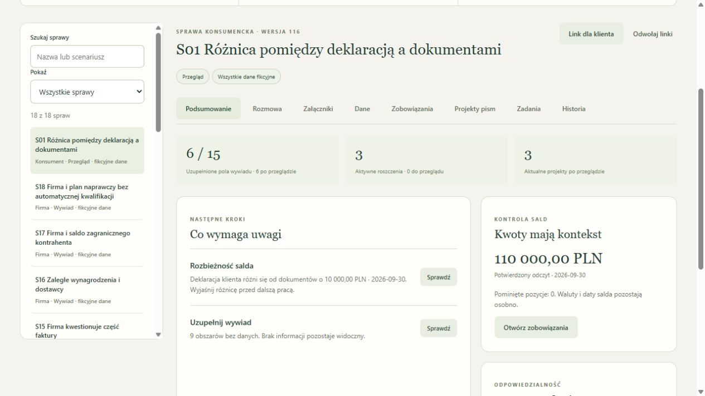

# CaseCheck — wywiad, dokumenty i przegląd sprawy

[](https://github.com/krapcys1-maker/casecheck/actions/workflows/tests.yml)

Otwarty projekt przyjmowania spraw konsumenckich i firmowych. Wersja pilotażowa prowadzi od rozmowy i załączników do kartoteki wierzycieli, przeglądu danych oraz projektów dokumentów. Dane mają źródła; zatwierdzanie należy do konta prawnika.

**Projekt portfolio:** klient deklaruje 120 tys. zł, dokumenty wskazują 110 tys. zł. CaseCheck pokazuje różnicę 10 tys. zł, źródła i następne zadania. To działający przykład projektowania obiegu danych z AI, przeglądem człowieka i wdrożeniem.

[Panel HTTPS](https://astrologiapoludzku.com/casecheck/) · [Prezentacja projektu](docs/PORTFOLIO.md) · [Demo w 8 minut](docs/DEMO.md) · [Jak działa](docs/ARCHITEKTURA.md) · [Instrukcja](docs/OBSLUGA.md) · [Wyniki i zakres testów](docs/TESTY.md)

Dostęp do panelu wymaga konta; danych logowania nie publikujemy. Pokaz korzysta z przygotowanych fikcyjnych spraw i zapisanych odczytów. Projekt powstaje z pomocą agenta AI; testowa symulacja roli prawnika nie jest niezależnym przeglądem prawnym.

[Trzystronicowe portfolio PDF](output/pdf/casecheck-portfolio.pdf) · [Opis projektu do CV](docs/OPIS-DO-CV.md)

[Aktualny audyt i plan testów](docs/AUDYT.md) · [Przygotowanie rozmowy z Booster](docs/ROZMOWA-BOOSTER.md) · [Pakiet do integracji](docs/INTEGRACJA.md). Portfolio PDF zachowuje wcześniejszy pokaz; audyt opisuje późniejsze naprawy i trudniejszą próbę AI, również jej niepowodzenia.

[Stan bieżących prac](docs/STATUS-PROJEKTU.md): lokalnie **121/121 testów**. Najnowszy [ręczny przegląd korekt](docs/RECZNE-TESTY-KOREKT.md) obejmuje wycofanie błędnych danych, zależności wierzyciela, sporu i zabezpieczenia, odrzucanie pustych pism, restart oraz PDF/Word. Ponowiono sześć scenariuszy HTTP z zapisanymi odpowiedziami. W tym etapie nie wykonywano nowych płatnych wywołań modelu, budżet pozostał 20/20. [Porównanie z LegalFlow](docs/POROWNANIE-LEGALFLOW.md) oddziela deklaracje producenta od sprawdzonych funkcji. Wcześniejsze dowody: [portal i nowe odczyty API](docs/RECZNY-PRZEGLAD-PORTALU.md), [OCR](docs/ocr-review-2026-10-03.json), [odbiór 17 wywołań API](docs/acceptance-2026-10-03.json), [ręczne porównanie 200 krótkich tekstów](docs/RECZNY-PRZEGLAD-200.md). Najnowszą wersję aplikacji wdrożono na VPS; [ręczny odbiór aktualizacji](docs/RECZNY-ODBIOR-VPS.md) opisuje zachowanie 18 spraw i 46 plików oraz próby portalu i eksportów. Przeniesienie na inproduction.dev czeka na administratora.



[Prezentacja PowerPoint i PDF, 22 slajdy](output/presentation/README.md) · [Katalog wszystkich funkcji i zakres sprawdzenia](docs/FUNKCJE-I-WERYFIKACJA.md) · [Dodatkowe ręczne testy zadań i rejestrów](docs/REJESTRY-I-ZADANIA-PRZEGLAD.md).

## Działające moduły

- Portal klienta: prośby o uzupełnienie, odpowiedzi z załącznikami, wiadomości kancelarii, widoczność plików, udostępnienie aktualnego zatwierdzonego PDF i potwierdzenie zapoznania się. Zmiana danych lub wzoru blokuje pobranie poprzedniej wersji.
- Własne wzory kancelarii: edytor sekcji i pól, niezmienna historia wersji, zatwierdzanie, podstawianie potwierdzonych informacji i cytatów. Eksport PDF oraz edytowalnego DOCX; brak importu dowolnych szablonów Word i podpisu elektronicznego.
- Konta administratora, prawnika i pracownika, hasła scrypt, wygasające sesje i link klienta do jednej sprawy. Dostęp sprawdzany według kancelarii oraz zakresu linku.
- Trwała kartoteka SQLite, rozmowa po polsku, wywiad konsumencki lub firmowy, poprawki i prośba o kontakt z człowiekiem.
- Hybrydowy odczyt roszczeń: lokalne reguły dla jednoznacznych pól, OpenAI, Anthropic lub DeepSeek dla pozostałych. Typy, kwoty w groszach, daty i dosłowne cytaty walidowane na serwerze. Zapis wersji promptu i reguł, wejścia oraz zużycia tokenów.
- Trwały zapis wyniku przed zastosowaniem do sprawy; jawne odzyskanie po awarii końcowego zapisu lub restarcie. Bez ponownego wywołania API, podwójnych danych i nadpisywania ręcznych korekt. [Jak odzyskać wynik](docs/ODZYSKIWANIE-WYNIKOW.md).
- Prywatny upload PDF, TXT, PNG i JPEG. Lokalny odczyt PDF.js w ograniczonym procesie roboczym. OCR przez OpenAI po osobnym uruchomieniu i potwierdzeniu przekazania całego wskazanego pliku.
- Oryginał i transkrypcja obok siebie, przegląd każdej strony OCR, korekty z historią i powiązanie zatwierdzenia z hashami. Zmieniony odczyt wycofuje zależne zatwierdzenia, sumy i pisma do ponownego sprawdzenia.
- Ręczne korekty i przegląd, wcześniejsze wartości, wykrywanie zgodnych numerów umów oraz ręczne powiązanie dokumentów jednego długu. Sumy według waluty i daty.
- Pięć edytowalnych wzorów: karta sprawy, pomocniczy wykaz wierzycieli, prośba o uzupełnienie, prośba o wyjaśnienie roszczenia i szkic wstępnego planu restrukturyzacyjnego. Eksport PDF; zmiana danych unieważnia poprzedni projekt.
- Etapy, zadania, przypisanie do konta, dziennik wersji i eksport JSON. Termin prawny wymaga prawnika, podstawy i daty rozpoczynającej bieg.
- Podsumowanie sprawy: braki, odczyty do przeglądu, rozbieżności, spory i zadania. Filtry kartoteki, przypisywanie do nazwanych osób oraz rozdzielenie aktualnych i wcześniejszych pism.
- Pakiet JSON dla prawnika: potwierdzone wartości, cytaty, strony, hashe plików, braki i blokady. Eksport jest punktem startowym integracji, bez automatycznej transmisji.
- Aktualny odpis KRS i wykaz VAT MF, z adresem źródła, datą i identyfikatorem zapytania. Dla fikcyjnych spraw VAT korzysta ze środowiska testowego.
- Kopia bazy wraz z plikami, hashe, kontrola integralności i test odtworzenia. Usuwanie aktywnej sprawy wraz z historią i linkami.

## Uruchomienie

Node.js 22.18+ i npm. Modele działają przez zewnętrzne API.

```powershell
git clone https://github.com/krapcys1-maker/casecheck.git
cd casecheck
npm ci
Copy-Item .env.example .env
# Uzupełnij wybrane klucze API i własne długie hasło administratora.
npm test
npm start
```

Aplikacja nasłuchuje na `127.0.0.1:8861`, ścieżka `/casecheck/`. Konto początkowe: `admin@casecheck.local`; hasło z `CASECHECK_ADMIN_PASSWORD`. Administrator tworzy konta. Przycisk „Wczytaj 18 testowych spraw” importuje fikcyjne źródła i pliki; nie przedstawia ich jako wyników AI. Odczyt uruchamia się osobno.

Publiczne wdrożenie wymaga wybranej domeny i HTTPS. [Instrukcja VPS](deploy/APP.md) opisuje usługę użytkownika, prywatny stan, kopie i wycofanie. `.env`, hasła, baza, pliki klientów i lokalne raporty są wykluczone z Git.

## Dane i pisma

[18 pełnych spraw testowych](tests/full-fixtures/README.md) zawiera 48 PDF-ów, dwa skany PNG, rozmowy i oczekiwania: cesję, spór, kilka umów jednego banku, różne waluty, brak daty, hipotekę, leasing, zerowy dochód, nieczytelność oraz instrukcję w niezaufanym materiale. Cztery przypadki mają oznaczenie holdout; zestaw nie jest niezależnym badaniem skuteczności.

Wzory i pytania oparto na [oficjalnych źródłach](legal/README.md), sprawdzonych 2 października 2026 r. Są materiałami przygotowawczymi. Karta i wykaz nie zastępują urzędowego formularza lub proceduralnego spisu wierzytelności. Model nie kwalifikuje do postępowania i nie składa pism. Baza pytań oraz wzorów wymaga zatwierdzenia przez kancelarię przed analizą rzeczywistych danych.

Wybrane źródła trafiają do wskazanego API. OCR przekazuje cały wskazany plik do OpenAI. `store:false` nie zapewnia braku retencji u dostawcy. Nie wdrożono pełnego KRZ, CEIDG, BIR ani automatycznej wysyłki. KRS/VAT nie podają prywatnych długów klienta. Upload nie obejmuje DOCX i ZIP; eksport projektów do DOCX jest dostępny.

## Testy i limity

`npm test` działa bez kluczy i płatnych wywołań. GitHub Actions sprawdza Node 22 i 24. Testy obejmują izolację, role, linki, wyścig wersji, awarię AI, PDF/skany, kopię i odtworzenie, integralność danych, waluty i duplikaty.

Aktualny zestaw zawiera **121 testów**. `npm run ai:bench` pokazuje plan bez API, a `node scripts/quality-bench.mjs --run` wykonuje płatną próbę na siedmiu syntetycznych PDF-ach. Osobny trwały limit runnera: 9 prób/dzień UTC. [Wyniki próby przed ostatnimi poprawkami](docs/quality-bench-2026-10-03.json) zawierają także odrzucone odczyty i błędną interpretację; nie są pomiarem ogólnej skuteczności.

`npm run test:acceptance` pokazuje bezpłatny plan testu całej aplikacji. `node scripts/acceptance.mjs --run` korzysta z kluczy z `.env` i osobnego stanu `data/local/acceptance`: do 16 wywołań, trwały limit 20/dzień UTC. `--resume` kontynuuje istniejący stan, a świadome ponowienie odczytu dokumentów jednej sprawy wymaga `--resume --retry-case S04`. Nie ma automatycznego logowania przez przeglądarkę ani ponawiania błędów w pętli. Test używa wyłącznie fikcyjnych danych; konta ról nie stanowią niezależnego przeglądu prawnego. [Zakres i wynik](docs/TESTY.md).

`npm run ai:bench:extended` pokazuje plan hybrydowej próby na większym zestawie, bez API. [Raport 200 fikcyjnych dokumentów](docs/extended-evaluation-2026-10-03.json) zawiera wcześniejsze próby i odtworzenie zapisanych odpowiedzi z końcowymi regułami. Odtworzenie: 1397 zgodnych pól, 3 pozostawione do przeglądu, 0 błędnych znanych wartości. Reguły rozwijano na tych materiałach; wynik nie jest niezależną oceną rzeczywistych spraw ani OCR.

Trwały limit: 20 żądań AI na dzień UTC i jedno wywołanie naraz. Błędy także zużywają rezerwację; brak automatycznych powtórek. To limit liczby żądań, nie rachunku w walucie. Wynik starej wersji jest odrzucany. Zapisany wynik przerwanego zadania odzyskuje pracownik w Historii; operacja nie zużywa rezerwacji. Brak zapisanego wyniku wymaga osobnej decyzji o ponownym odczycie. Jeden proces aplikacji może posiadać dany katalog stanu.

`node scripts/smoke-workflow.mjs --prepare` przygotowuje fikcyjny stan bez API. `--run` wykonuje do ośmiu płatnych żądań OpenAI i eksportuje pięć PDF-ów do kontroli. Nie uruchamiaj go równolegle z aplikacją na tym samym stanie. Lokalne hasła i raporty są ignorowane przez Git.

Poprzedni panel pojedynczych scenariuszy: `npm run start:lab`, port 8860. Jego [instrukcja](deploy/README.md) i [pierwsze wyniki API](WYNIKI-TESTU-API.md) opisują wcześniejszy etap. Runner `ai:smoke` jest osobną płatną próbą na maksymalnie dziewięciu zadaniach.

## Research i licencje

[Research GitHub](RESEARCH-I-REKOMENDACJE.md), [źródła danych](ZRODLA-DANYCH-BOTA.md) i [zakres procesu](PLAN-PELNEGO-BOTA.md). Użyto PDF.js (Apache-2.0), PDFKit (MIT), docx (MIT), SQLite z Node i fontu DejaVu z [odrębną licencją](assets/DejaVu-LICENSE.txt). Własny kod i dokumentacja: [MIT](LICENSE). [Zasady współpracy](CONTRIBUTING.md).

Projekt nie jest produktem ani oficjalną integracją Legal Flow. Research nie daje podstaw do deklarowania równej skuteczności, bezpieczeństwa lub kompletności funkcji komercyjnego systemu.
