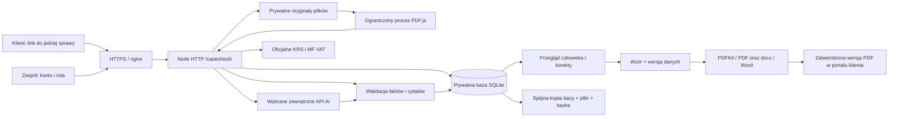

# Jak działa CaseCheck

Zmiany po audycie: rezerwacja AI i start zadania są jedną transakcją; wynik sprawdza wersję danych, więc zadanie administracyjne nie przerywa odczytu. Start i porażka AI nie unieważniają pism. Zatwierdzenie bazy wiedzy jest związane z hashem aktualnego zestawu. [Pakiet po przeglądzie](INTEGRACJA.md) udostępnia wyłącznie potwierdzone wartości i wymienia blokady.

Aktualna implementacja: Node.js 22.18+, moduły JavaScript ESM, HTTP z biblioteki standardowej, SQLite (`node:sqlite`), zwykły frontend HTML/CSS/JS, PDF.js, PDFKit i docx. Trzy pakiety aplikacyjne są przypięte w lockfile. Starsza wersja działa na jednym VPS; najnowsze zmiany zweryfikowano lokalnie. Wcześniejsze propozycje Next.js/Postgres w planach historycznych nie są opisem wdrożonego stosu.

## Od informacji do dokumentu

1. Wiadomość lub strona dokumentu staje się źródłem o własnym ID. Oryginał pliku ma hash SHA-256; strony i sposób odczytu pozostają powiązane z dokumentem.
2. Osobne uruchomienie AI wybiera pola i źródła. Podgląd pokazuje treść przeznaczoną do wysłania. Zgoda dotyczy wskazanego dostawcy. OCR przekazuje cały wybrany plik do OpenAI po osobnym potwierdzeniu w panelu.
3. Serwer rezerwuje jedno wywołanie z dziennego budżetu UTC. Nie ponawia automatycznie nieudanej operacji. Zapisuje rodzaj zadania, model, źródła, hash wejścia, wersję promptu i raportowane zużycie.
4. Odpowiedź musi zawierać żądane pola i poprawny ogólny kontrakt. Kwota jest całkowitą liczbą groszy, data musi być poprawną datą kalendarzową, a cytat musi występować we wskazanym źródle. Nieprawidłowy typ konkretnego pola aplikacji zostaje oznaczony jako `unknown` z ostrzeżeniem; wadliwy JSON/kontrakt nadal blokuje odczyt. Filtr adresu wymaga jawnego związku właściwego wierzyciela z adresem. To ogranicza opisane błędy, ale nie dowodzi poprawności wszystkich interpretacji.
5. Znane wartości trafiają do przeglądu. Ręczna korekta dodaje źródło z uzasadnieniem. Poprzednia wartość pozostaje w historii. Odczyt `unknown` nie usuwa wcześniejszej znanej wartości.
6. Prawnik weryfikuje fakty i roszczenia. Dokumenty tej samej umowy wymagają ręcznego powiązania, wskazania właściwego salda i ponownego przeglądu. Oba źródła pozostają dostępne.
7. Wzór przygotowuje projekt na aktualnej wersji danych. Przegląd i eksport odnoszą się do tej wersji. Zmiana danych oznacza wcześniejsze projekty jako nieaktualne.

## Model danych i współbieżność

| Element | Co zapisujemy |
|---|---|
| `users`, `sessions` | Kancelaria, rola, hash hasła scrypt, hash sesji i jej wygaśnięcie |
| `cases` | Aktualny stan JSON, kancelaria i numer wersji |
| `versions`, `audit` | Stan kolejnych wersji oraz zdarzenie, osoba/konto i czas |
| `links` | Hash tokenu, jedna sprawa, wygaśnięcie i odwołanie |
| `budget`, `registry_budget` | Trwały licznik operacji na dzień UTC |
| `knowledge` | Wersje pytań/wzorów/źródeł i stan ich zatwierdzenia |
| `job_results` | Oczekujące wyniki odczytów, zadanie, wersja danych, wejście, metadane i hash zapisu |
| `firm_templates`, `firm_template_versions` | Wzory kancelarii i niezmienne wersje; zatwierdzony hash, pola i ścieżki; schemat SQLite v3 |
| Stan sprawy | Źródła, wiadomości, dokumenty, fakty, roszczenia, projekty, zadania, odczyty, prośby do klienta i udostępnienia pism |

`revision` chroni każdą zmianę przed nadpisaniem przez drugi formularz. Nieaktualne żądanie otrzymuje 409 i panel odświeża dane. `data_revision` zmienia się przy zmianie materiału do dokumentów, w tym przeglądzie; zadanie lub zmiana etapu zachowuje zatwierdzenie pisma. Edycja pisma zmienia jego hash i cofa status zatwierdzenia. Historyczny stan pozostaje w wersjach sprawy.

W pilotażu działa jeden proces aplikacji i jedno wywołanie AI naraz. Blokada PID zapobiega uruchomieniu dwóch pracowników na tym samym stanie. Wynik kończący się po ręcznej zmianie danych zostaje odrzucony jako wynik wcześniejszej wersji. SQLite używa WAL, kluczy obcych i transakcji.

Zweryfikowany wynik AI/OCR zostaje najpierw zatwierdzony w osobnej transakcji `job_results`, a dopiero potem zastosowany do sprawy. Zapis faktów, historii, audytu oraz usunięcie oczekującego wyniku są jedną transakcją. Awaria końcowego zapisu pozostawia wynik do jawnego odzyskania przez zespół. Restart oznacza zadanie jako przerwane, zachowuje `data_revision` i nie wywołuje API. Odzyskanie sprawdza hash, kontrakt i wersję; nowsze dane nie są nadpisywane. Brak zapisanego wyniku wymaga osobnej decyzji o ponowieniu. [Szczegóły i granice](ODZYSKIWANIE-WYNIKOW.md).

## Granice dostępu

Administrator zarządza kontami; prawnik zatwierdza dane, pisma, bazę wiedzy oraz terminy prawne; pracownik prowadzi czynności przygotowawcze. Każdy odczyt sprawy sprawdza kancelarię. Link klienta wygasa po siedmiu dniach i udostępnia wyłącznie wywiad/załączniki jednej sprawy, bez wewnętrznych faktów, zadań, historii i odczytów API.

Portal dodaje prośby, odpowiedzi z plikami i wybrane zatwierdzone PDF-y. Udostępnienie jest związane z ID pisma, hashem treści i wersją danych; każdy download ponownie sprawdza aktualność. Zmiana wzoru i wycofanie zależnych projektów zapisują się atomowo. Starego projektu nie można ponownie uaktywnić zwykłą edycją. Nowe pliki zespołu są prywatne; klient widzi własne i jawnie udostępnione. Istniejące pliki bez pola widoczności pozostają widoczne jak przed aktualizacją.

Odpowiedź klienta zmienia materiał sprawy; wiadomość zespołu, przyjęcie prośby lub potwierdzenie przeczytania są zmianami operacyjnymi. Nie są automatyczną akceptacją faktów. Portal nie wysyła maili/SMS i nie wykonuje podpisu elektronicznego. Word jest eksportem dla zespołu, a nie edytorem zsynchronizowanym ze stanem sprawy.

`GET /api/team` zwraca zespołowi tylko aktywne ID, nazwę i rolę z własnej kancelarii. Klient nie ma dostępu. `GET /api/cases` zawiera operacyjne liczniki własnych spraw, z których panel wylicza stan kartoteki. Liczniki nie oznaczają prawnej gotowości sprawy.

Sesja konta wygasa po ośmiu godzinach. Token jest przechowywany w pamięci strony, a link klienta jest usuwany z paska adresu po otwarciu. Wszystkie pliki i API wymagają autoryzacji. Klucze dostawców pozostają na serwerze; odpowiedzi błędów nie zawierają surowych odpowiedzi dostawcy. Nagłówki ograniczają cache, osadzanie i źródła skryptów. Origin jest przypięty do publicznego HTTPS.

## Ograniczenia zasobów

- 20 wywołań AI dziennie domyślnie, osobny licznik zapytań rejestrowych. Błąd po rozpoczęciu zużywa rezerwację.
- Upload do 8 MB, 40 plików na sprawę; PDF/TXT/PNG/JPEG po sprawdzeniu nagłówka formatu.
- Czytnik PDF: 20 stron, ograniczenia czasu, pamięci i liczby znaków; wynik pustego skanu wymaga OCR.
- OCR OpenAI: do 3 MB i 5 stron; wynik ma osobne źródła i oznaczenie wymagające porównania z obrazem.
- API KRS/VAT korzystają z ustalonych oficjalnych hostów, limitu czasu i rozmiaru odpowiedzi. W fikcyjnych sprawach VAT używa testowego środowiska MF.

## Pliki warte otwarcia podczas rozmowy

- [`domain.mjs`](../src/app/domain.mjs): typy, sumy, braki, podsumowanie i wzory.
- [`application.mjs`](../src/app/application.mjs): cały obieg, wyścig korekty z AI, uprawnienia i wersjonowanie.
- [`store.mjs`](../src/app/store.mjs): transakcje, izolacja, sesje, katalog zespołu i budżet.
- [`app-server.mjs`](../src/app-server.mjs): granica HTTP, rozmiary wejścia, origin i kontrola plików.
- [`full-app.test.mjs`](../tests/full-app.test.mjs): izolacja, backup, wyścigi i pięć pełnych przepływów HTTP.

## Co wymaga dalszego wdrożenia

Przed rzeczywistym pilotażem potrzebny jest niezależny przegląd prawny pytań i wzorów, uzgodnienie warunków przetwarzania danych oraz zasad retencji i obsługi kopii. Nie ma automatycznej wysyłki, integracji KRZ, składania wniosków, kalkulatora terminów procesowych ani pełnego planu restrukturyzacyjnego. Nie ma RAG po aktach sprawy. Kolejne integracje powinny wynikać z uzgodnionego procesu i pomiarów pilotażu.
