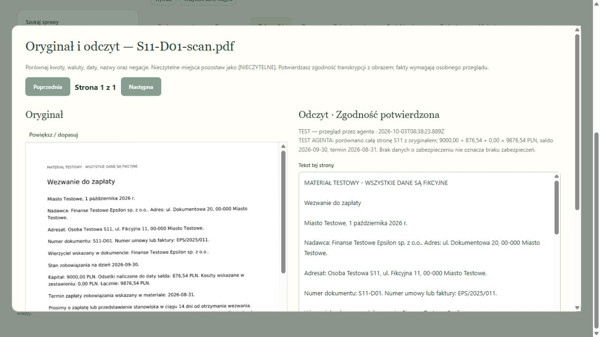

# Przegląd oryginału i odczytu

W Załącznikach przycisk **Porównaj z oryginałem** pokazuje obraz PDF lub skan obok transkrypcji. Oryginał jest pobierany z serwera aplikacji z uprawnieniami do konkretnej sprawy. Wyświetlenie, korekta i przegląd nie wywołują modelu ani nie zużywają budżetu API.

1. Przejdź przez każdą stronę. Porównaj nazwy, liczby, waluty, daty i negacje. Nieczytelny fragment zachowaj jako `[NIECZYTELNE]`.
2. Przy błędzie popraw tekst i opisz różnicę. Zapis tworzy nową wersję transkrypcji; poprzedni tekst, cytaty i oryginalny plik pozostają dostępne.
3. Konto z rolą prawnika potwierdza zgodność strony albo odrzuca odczyt. Potwierdzenie wiąże konkretny tekst z hashem oryginalnego pliku, kontem i czasem.
4. Po korekcie odczytaj ponownie zależne dane lub popraw pola ręcznie i sprawdź je osobno. Samo potwierdzenie transkrypcji nie potwierdza roszczenia ani prawdziwości twierdzeń wierzyciela.
5. Utwórz i sprawdź nowy projekt pisma. Dotychczasowe zatwierdzenie nie przechodzi na zmienione dane.

Nieprzejrzane lub odrzucone strony blokują zatwierdzenie zależnego roszczenia i projektów oraz trafiają do blokad pakietu JSON. Kwoty oparte na nieaktualnym odczycie nie wchodzą do sum. Także starsze bazy, utworzone przed wprowadzeniem przeglądu stron, podlegają nowym kontrolom. Podgląd historycznego pisma może nadal zawierać dawne dane, ale nie otrzymuje aktualnego oznaczenia zatwierdzenia.

## Co sprawdzono 3 października 2026

- Osiem testów funkcji: dwie strony, role i kancelarie, stare zatwierdzenia, atomowy rollback, spóźnione AI, korekta z historią, blokady eksportu i stary adres/kwota. Cały zestaw: **106/106**.
- Ręczna obsługa lokalnego ekranu na kopiach S11/S12 z rzeczywistymi wcześniejszymi odpowiedziami OCR. Porównano pełne obrazy z transkrypcjami. S11: 9876,54 PLN; S12: kwota nieczytelna pozostaje nieznana. OCR S12 pominął stopkę testową i numer strony — dodano je ręcznie w izolowanej kopii.
- W interfejsie odrzucono stronę, sprawdzono odmowę zatwierdzenia roszczenia, poprawiono transkrypcję, zachowano historię i potwierdzono, że dawne pola nadal wymagają ponownego odczytu. Brak błędów renderera PDF/worker w konsoli. Skrajne przyciski nawigacji są wyłączone.
- Ponowne przejście sześciu scenariuszy HTTP z zapisanymi odpowiedziami: **6/6**, nowe API wyłączone, budżet przed i po **17/20**. Konta testowe symulują role. Przegląd agenta nie jest akceptacją niezależnego prawnika.
- [Dowody techniczne](ocr-review-2026-10-03.json), [dwie dokładnie wskazane transkrypcje](ocr-reviewed-pages-2026-10-03.json).

Zmianę zweryfikowano lokalnie. Nie wdrożono jej jeszcze na VPS. Obecne limity OCR pozostają 5 stron i 3 MB; brak pomiaru jakości na rzeczywistych aktach, telefonie i wszystkich typach skanów.
