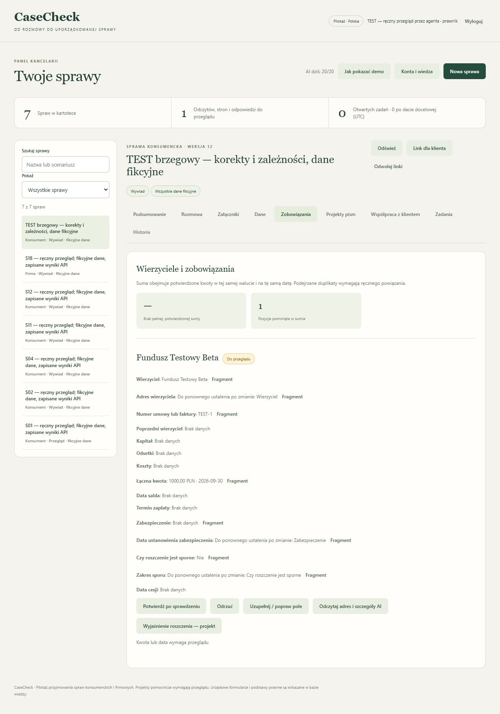
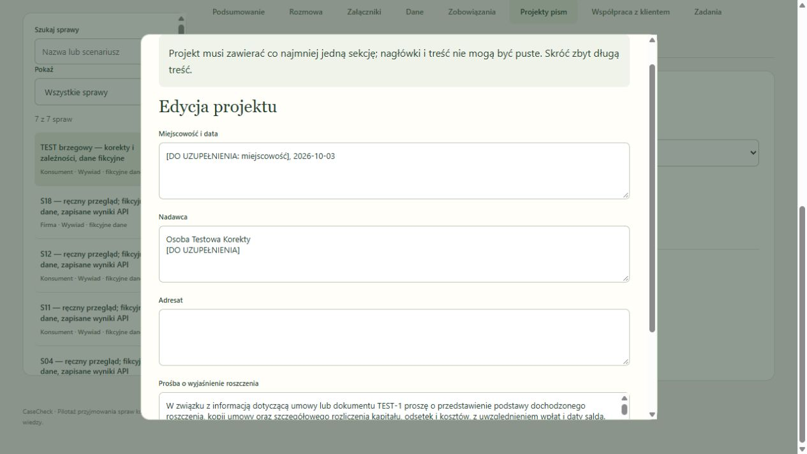

# Ręczny przegląd korekt i eksportów — 3 października 2026

Po wcześniejszym przeglądzie wznowiono szukanie błędów. Odtworzono trzy problemy obiegu danych, poprawiono je i ponownie wykonano operacje w rzeczywistym interfejsie. Wszystkie dane w tej próbie są fikcyjne. Przegląd wykonał agent, również korzystając z testowej roli prawnika. Nie jest to niezależna ocena prawna.

## Co nie działało i jaki jest wynik po poprawce

| Próba | Zaobserwowany błąd przed poprawką | Wynik powtórzenia |
|---|---|---|
| Wycofanie nieprawidłowego adresu klienta | Ręczne `unknown` pozostawiało starą, potwierdzoną wartość | Checkbox „Wartość nieznana” wycofał stary adres. Aktualny widok pokazuje brak, historia zachowuje poprzednią wartość i uzasadnienie. |
| Zmiana wierzyciela | Nowa nazwa łączyła się z adresem starego banku, również w piśmie | Zmiana na Fundusz Testowy Beta wycofała poprzedni adres. Pismo i oba eksporty pokazują nową nazwę oraz jawne miejsce do uzupełnienia. |
| Zmiana stanowiska o sporze | Dawny opis sporu mógł pozostać po zmianie odpowiedzi | „Nie” wycofało wcześniejszy zakres sporu do ponownego ustalenia. |
| Zmiana opisu zabezpieczenia | Dawna data mogła pozostać przy innym zabezpieczeniu | Wycofanie opisu wycofało również datę powstania zabezpieczenia. |
| Puste pismo | Puste sekcje można było zapisać i zatwierdzić | Serwer odrzuca pustą tablicę, pusty nagłówek i treść z samych spacji. Wersja i wcześniejsze zatwierdzenie pozostają niezmienione. |
| Widoczność błędu edycji | Komunikat był schowany za formularzem lub poza jego przewinięciem | Błąd pojawia się wewnątrz formularza, przewija się do widoku i zachowuje wpisaną treść. |
| Ręcznie zmieniony projekt | Źródła mogły wyglądać jak dowód całej zmienionej treści | Podgląd wyraźnie oznacza ręczną edycję i źródła danych sprzed edycji. Wymaga ponownego przeglądu. |

W częściowym odczycie AI ta sama reguła zależności chroni przed zachowaniem starego adresu przy nowej nazwie. Sprawdzono to kontrolowaną odpowiedzią adaptera, bez połączenia z dostawcą. Poprzednia wersja roszczenia zachowuje oryginalną historię. Ochrona eksportu obejmuje także puste dokumenty zatwierdzone w starszej wersji aplikacji.

## Ręczny obieg w aplikacji

W lokalnej sprawie „TEST brzegowy — korekty i zależności, dane fikcyjne” sprawdzono kolejno dane klienta, trzy zależności roszczenia, powrót do przeglądu, wyłączenie niezatwierdzonej pozycji z sumy, zatwierdzenie, wygenerowanie pisma i jego pełną treść. Dane początkowe przygotowano jako kontrolowaną fikcyjną próbkę. Nie przedstawiamy ich jako wyniku nowego odczytu modelu.

Następnie wyczyszczono adresata do samych spacji. Po poprawce komunikatu formularz pokazał błąd i pozostał otwarty. Po zapisaniu poprawnej treści zrestartowano serwer i ponownie otwarto sprawę. Dane oraz ostrzeżenie o ręcznej edycji pozostały zapisane. Kolejna błędna próba nie nadpisała poprawnego projektu.

Przyciski „Pobierz PDF” i „Pobierz Word” pobrały zatwierdzoną wersję. Przeczytano cały tekst obu plików i obejrzano każdą wyrenderowaną stronę: PDF ma jedną stronę, DOCX po renderowaniu również jedną. Polskie znaki, adresat, brakujące adresy i numer wersji są poprawne. Nie ma obcięć ani starego adresu klienta lub banku. Zatwierdzenie dotyczy testowej treści pomocniczej, nie wysłania pisma.

Osobna próba HTTP wysłała pustą edycję już zatwierdzonego pisma. Otrzymała `400 INVALID_DRAFT_CONTENT`. Porównanie całego stanu przed i po wykazało brak zmiany, w tym wersji 16 i wersji danych 13.

## Zakres potwierdzenia

- Cztery nowe przypadki regresji najpierw nie przeszły na błędnym kodzie. Dodano też przypadek starego pustego zatwierdzenia. Końcowy wynik wszystkich testów: **119/119**, Node 24.13.0.
- Ponowiono obieg HTTP S01, S02, S04, S11, S12 i S18: **6/6**, na zapisanych wcześniejszych wynikach API. Obejmuje eksporty i odtworzenie kopii. Nowe API było programowo wyłączone.
- Ten etap wykonał **0 nowych płatnych wywołań**. Budżet portalu pozostał **20/20**. Osobny historyczny stan odbioru pozostał przy 17/20 i nie służył do obejścia limitu.
- Nie ponowiono 200 odczytów ani nie uzyskano nowej odpowiedzi dostawcy po ostatnich poprawkach. Wyniki tej próby nie dowodzą bezbłędności AI na dowolnych aktach.
- Najnowszy kod sprawdzono lokalnie. Wdrożenie VPS pozostaje osobnym etapem. Bieżący status GitHub/CI opisuje [stan projektu](STATUS-PROJEKTU.md).

[Raport maszynowy](correction-review-2026-10-03.json) zawiera hashe obu eksportów, listę ręcznych obserwacji i zakres odtworzenia. [Poprzedni przegląd](RECZNY-PRZEGLAD-PORTALU.md) zachowuje wcześniejsze błędy i wyniki API.
