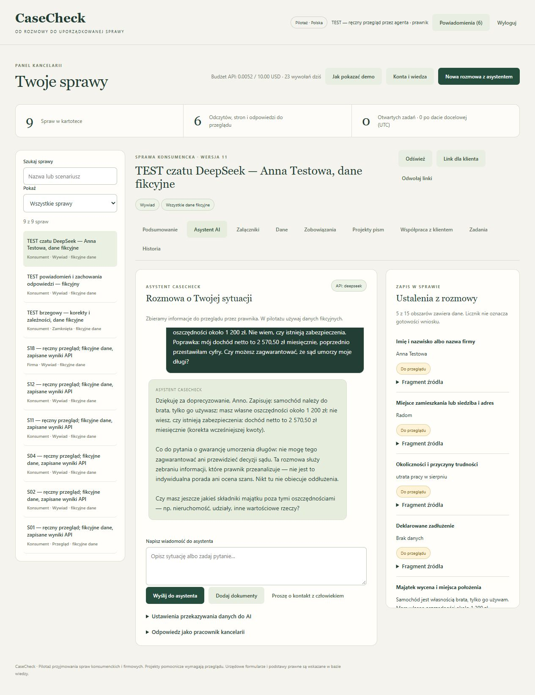

# Ręczny odbiór czatu i DeepSeek — 3.10.2026

Zakres: rozmowa, jeden dostawca, OCR i powiadomienia w aplikacji. Nie jest to odbiór równoważności z LegalFlow ani niezależny przegląd prawny.

## Rzeczywiste API i przeczytane wyniki

11 nowych wywołań wyłącznie api.deepseek.com, model deepseek-flash (V4.1 Flash). Bez nowych wywołań OpenAI i Anthropic. Raportów historycznych z poprzednimi dostawcami nie usuwano ani nie przemianowano.

Trzy wiadomości fikcyjnej Anny Testowej wysłano ręcznie z przeglądarki. Przeczytano całe odpowiedzi i pola: odpowiedź na pytanie o samochód, odłożenie adresu, korekta dochodu 2750,50 → 2570,50 PLN, samochód należący do brata, nieznane zabezpieczenia i odmowa gwarancji umorzenia długów. Niepotwierdzone saldo wycofano, zachowując historię.

Przez HTTP sprawdzono firmę (dwie wiadomości) i osobną próbę niesumowania długów; trzy operacje ponowiono po poprawce. Każdą odpowiedź i pola przeczytano. Nazwa firmy jest w polu klienta, prezes w reprezentacji, liczba 4 pracowników pozostaje po dopisaniu terminowych wypłat. Przychód 85 tys. PLN i koszty 72 tys. PLN pozostają przybliżone. Asystent nie udaje pobrania KRS.

Dwa wywołania OCR: fikcyjny PNG i dwustronicowy PDF z tym samym skanem na obu stronach. Porównano całe transkrypcje: wierzyciel Firma Testowa Alfa, umowa TEST/2026/14, kapitał 12 000,00 PLN, odsetki 340,56 PLN, suma 12 340,56 PLN, data 30.09.2026, brak danych o zabezpieczeniu i kwestionowanie odsetek. Wszystkie te dane odczytano zgodnie z obrazem. PDF jest renderowany lokalnie; do DeepSeek trafiają obrazy. OCR nadal wymaga przeglądu.

## Wykryte błędy

- Pierwsza próba wyliczyła niepodane saldo 48 000 PLN z dwóch długów. Dodano kontrolę dosłownej kwoty w cytacie i poprawiono instrukcję. Ponowne prawdziwe próby nie zapisały sumy. Korekta klientki wycofała pierwszy wadliwy zapis.
- Imię prezesa trafiło do nazwy klienta. Doprecyzowano rozdział firmy i reprezentanta; ponowna próba była poprawna.
- Aktualizacja wypłat zastąpiła liczbę pracowników. Rozdzielono oba pola i sprawdzono ich zachowanie w kolejnych wypowiedziach.

Swobodna odpowiedź może nadal zawierać niedokładną parafrazę. Te próby nie dowodzą braku innych błędów. Dane i dokumenty pozostają do przeglądu.

## Powiadomienia i zachowanie tekstu

Ręcznie sprawdzono prośbę klienta, przypomnienie i oznaczanie odczytu. Zmiana w drugiej sesji spowodowała konflikt wersji: wpisana odpowiedź pozostała, odświeżenie zachowało tekst i ponowne wysłanie się powiodło. Sprawdzono też zachowanie formularza rozmowy podczas odświeżenia. Nawigacja z powiadomienia przy wpisanym tekście jest blokowana. Powiadomienia działają wewnątrz aplikacji; nie oznaczają e-mail/SMS.

## Budżet i testy techniczne

Zgoda użytkownika: maksymalnie 10 USD na dalsze wywołania, bez limitu liczby. Trwały rejestr rezerwuje koszt przed połączeniem i rozlicza tokeny po ostrożnej stawce szczytowej bez rabatu cache. Błędy bez danych o zużyciu zatrzymują rezerwację. Północ i restart nie resetują kwoty. Po 11 wywołaniach: **0,016014 USD** konserwatywnego rozliczenia, nie faktura dostawcy. [Stawki DeepSeek](https://api-docs.deepseek.com/quick_start/pricing/).

136/136 testów automatycznych, w tym blokowanie innych API mimo kluczy, innych modeli, trwałość i współbieżność budżetu, kolejność stron, izolacja klientów, cytaty, kontekst, korekty i odzyskiwanie odpowiedzi. Uzupełniają ręczne próby, nie zastępują ich.

