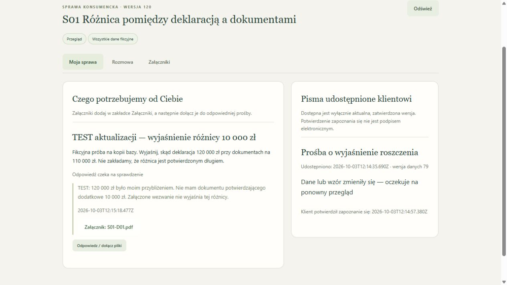

# Ręczny odbiór aktualizacji VPS — 3 października 2026

Najnowszą wersję aplikacji wdrożono na istniejącym VPS: commit `0c7c247ff82b6df91b2ab1efa0b049b44699833d`. Usługa działa przez dotychczasowe HTTPS. Przeniesienie do `https://inproduction.dev/casecheck/` nadal wymaga wykonania [przygotowanej komendy administratora](../deploy/PRZENIESIENIE-INPRODUCTION.md); podczas kontroli nowa trasa zwracała 404. Nie uznajemy aktualizacji kodu za zakończone przeniesienie domeny.

## Sposób sprawdzenia

Najpierw z istniejącej bazy wykonano i zweryfikowano kopię SQLite oraz 46 plików. Aktualny kod uruchomiono na jej odtworzeniu, na tym samym VPS, dostępnym wyłącznie przez tunel SSH. W tej kopii nowe wywołania modeli i OCR były jawnie wyłączone. Wykonano 121/121 testów na Node 22.22.1, następnie ręcznie używano interfejsu kancelarii i klienta w oddzielnych kartach przeglądarki.

Po starcie nowego kodu porównano z kopią wszystkie rekordy spraw, ich wersji, linków, kont, zatwierdzeń wiedzy i budżetu. Były identyczne; nowe tabele otrzymały wersję schematu 3. Testowe zmiany opisane poniżej wykonano później tylko w kopii. Nie przenoszono ich do działającej bazy.

## Co przeszedł agent ręcznie

| Próba | Obserwacja |
|---|---|
| Logowanie istniejącego konta | Działa na odtworzonej bazie oraz po wdrożeniu przez publiczne HTTPS. Widocznych jest 18 spraw. |
| S01: deklaracja i źródła | 120 000 zł deklaracji wobec 110 000 zł dokumentów; widoczna różnica 10 000 zł, dziewięć obszarów bez danych i trzy zadania. |
| Historyczne pismo | Przeczytano całą treść pisma do Banku Testowego Alfa; nadawca, adresat, numer umowy i data odpowiadają fikcyjnemu źródłu. |
| Word i PDF | Przyciski pobrały pliki na dysk. Odczytano całą treść DOCX i PDF; jedną stronę PDF wyrenderowano i obejrzano. Polskie znaki, adresy, treść i stopka są czytelne, bez obcięcia. Word nie był otwierany w Microsoft Word. |
| Prośba kancelarii | Dodano prośbę o wyjaśnienie 10 000 zł. Utworzenie prośby nie unieważniło zatwierdzonych pism. |
| Portal jednej sprawy | Nowy link otworzył S01 bez kartoteki innych spraw. Klient zobaczył prośbę oraz udostępnione zatwierdzone pismo. |
| Odczyt pisma | Klient pobrał PDF i potwierdził przeczytanie; czas potwierdzenia pojawił się w interfejsie. To nie podpis elektroniczny. |
| Odpowiedź klienta | Klient wpisał wyjaśnienie i dołączył wcześniej zapisany S01-D01.pdf. Odpowiedź czekała na sprawdzenie; kancelaria przeczytała ją i przyjęła. Nie testowano ponownie uploadu nowego pliku w tej próbie. |
| Nieaktualne pismo | Po odpowiedzi klienta wzrosła wersja danych i zniknął przycisk pobrania wcześniej udostępnionego pisma. Pojawił się komunikat o konieczności ponownego przeglądu; ślad przeczytania pozostał. |
| Oryginał i tekst | Otworzono S01-D01.pdf obok tekstu. Obraz strony załadował się; porównano wierzyciela, adresy, 50 000 zł, datę salda i numer umowy. W tej próbie nie wykonywano nowego OCR. |
| Własny wzór | Utworzono wzór, zatwierdzono go i wybrano w generatorze. Projekt poprawnie podstawił tytuł S01, datę i dziewięć brakujących obszarów; braków nie zastąpił zmyślonymi odpowiedziami. |
| S02 po publikacji | Publiczny panel pokazuje dwa możliwe dokumenty tej samej umowy: 50 000 zł i 53 200 zł. Obie pozycje pozostają poza sumą do powiązania; panel nie sumuje ich do 103 200 zł. |
| S04 po publikacji | Publiczny panel zachowuje 19 000 zł odczytu i osobne oznaczenie sporu; nieznany zakres sporu i poprzedni wierzyciel pozostają brakami. |

Zdarzenie pobrania Worda nie zostało zwrócone przez narzędzie automatyzacji przeglądarki w jego limicie czasu. Sprawdzenie katalogu pobrań potwierdziło rzeczywisty nowy plik; odczytano jego treść. Nie zaklasyfikowano ograniczenia narzędzia jako usterki aplikacji ani nie uznano samego kliknięcia za dowód pobrania.

## Kontrola działającego serwera

Przed aktualizacją wykonano drugą zweryfikowaną kopię. Zatrzymano i uruchomiono wyłącznie `casecheck-app`; nie zmieniano nginx, plików portfolio ani usług pozostałych stron. Po aktualizacji potwierdzono:

- aktywną usługę i health 200, zgodność publicznego `app.js` z aktualnym kodem;
- logowanie, 18 spraw, niezmienione rekordy istniejących danych i budżet;
- zgodność hashy wszystkich 46 plików źródłowych oraz eksport PDF;
- poprawny pakiet JSON S01 i jego hash, odmowę anonimowego API 401 oraz obcego origin 403;
- brak publicznego `.env` (404);
- niezmienione odpowiedzi i hashe 10 adresów obu stron, w tym podstron portfolio, CSS oraz kontaktu;
- brak nowych płatnych wywołań modeli w całym odbiorze.

[Metadane odbioru](vps-review-2026-10-03.json). Szczegółowe raporty, kopie i pliki pobrane podczas prób są prywatne.

## Czy to już odpowiada opisowi Booster AI?

**Nie w pełnym zakresie.** [Publiczna oferta LegalFlow](https://restrukturyzacja.boosterai.pl/) ponownie odczytana 3.10.2026 deklaruje m.in. portal, własne wzory, podpis i integracje oraz obsługę należności kancelarii. [Strona Booster AI](https://boosterai.pl/pl) opisuje również przetwarzanie wywiadów audio. Własny zakres i dowody zestawia [porównanie funkcji](POROWNANIE-LEGALFLOW.md).

Nasze ręczne próby potwierdzają konkretny obieg dokumentów, braków i przeglądu. Nadal brakuje podpisu, audio, automatycznych powiadomień, gotowych integracji CRM/SharePoint/KSeF i modułu należności kancelarii. Otwarta karta drugiej osoby wymaga odświeżenia, aby zobaczyć jej zmiany; nie ma automatycznej aktualizacji między kartami. Nie mamy porównawczych pomiarów jakości odczytu, szybkości obsługi ani skuteczności na tych samych aktach w LegalFlow. Deklaracji producenta nie traktujemy jak niezależnie zweryfikowanych wyników.

Nie stwierdzono nowej usterki aplikacji w wymienionych próbach. Ten odbiór nie oznacza ręcznego powtórzenia wszystkich wcześniejszych scenariuszy, nowego testu dostawców modeli ani niezależnego przeglądu prawnego. Nadal obowiązują ograniczenia z [audytu](AUDYT.md).
