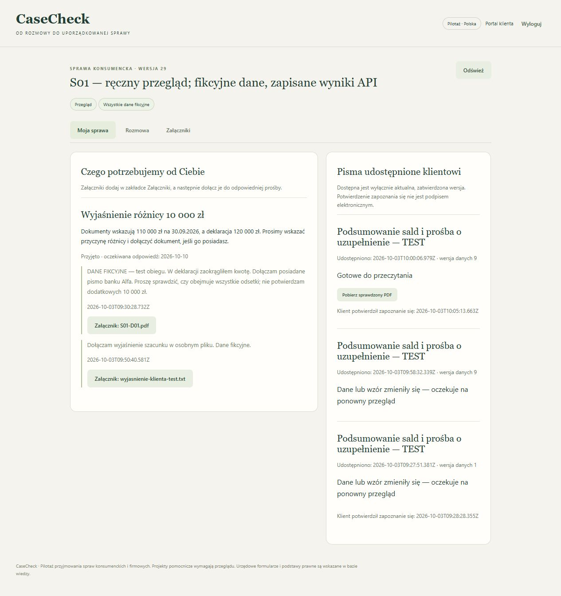

# Ręczny przegląd portalu, pism i odczytów — 3.10.2026

Przegląd wykonany przez agenta w lokalnej przeglądarce, na kopiach sześciu fikcyjnych spraw z wcześniejszego odbioru. Szczegółowe próby objęły S01, S02 i S04. Czytano źródła, wartości, cytaty, treść pism i gotowe eksporty. To nie jest opinia prawnika, niezależny benchmark ani ponowny pełny test 200 spraw.

Zapis podsumowania: [portal-review-2026-10-03.json](portal-review-2026-10-03.json). Materiały robocze, pełne odpowiedzi i baza są prywatne, w `reports/local/portal-qa` i `data/local/portal-review-ui-oTMDK5`. Na VPS nie wdrażano nowych zmian.

## Przebieg przeczytany i wykonany w interfejsie

| Próba | Zaobserwowany wynik |
|---|---|
| S01: deklaracja 120 000 PLN i trzy dokumenty | Źródła wskazują 50 000 + 40 000 + 20 000 = 110 000 PLN na 30.09.2026. Pierwotna różnica 10 000 jest widoczna. |
| Własny wzór kancelarii | Utworzono v1, zatwierdzono v2, wygenerowano i przeczytano pismo; eksport Word/PDF oraz udostępnienie klientowi działają. |
| Prośba do klienta i pierwsza odpowiedź | Klient dołączył istniejący dokument oraz informację, że deklaracja była zaokrągleniem. Wcześniej udostępnione pismo przestało być dostępne. |
| Ponowienie prośby | Zespół wskazał potrzebę pisemnego wyjaśnienia. Klient wgrał nowy fikcyjny TXT i odpowiedział z załącznikiem. Dashboard wskazał odpowiedź oczekującą na zespół. |
| Korekta szacunku | Zachowano kwotę 120 000 PLN i datę, oznaczono ją jako przybliżoną. Panel przestał prezentować wyliczenie dokładnej różnicy. Pismo pokazuje „około 120 000” i odrębne 110 000 z dokumentów. |
| Wiadomość kancelarii | Klient widzi ją jako wiadomość zespołu; nie staje się wypowiedzią klienta ani automatycznym źródłem jego danych. |
| Widoczność pliku zespołu | Nowa notatka początkowo prywatna, po udostępnieniu widoczna klientowi, po ukryciu znika. Własny upload klienta pozostaje dostępny. |
| Zmiana zatwierdzonego wzoru | Zapis v3 wycofał zależne pisma. Historia zachowała v1–v3. Po zatwierdzeniu v4 trzeba utworzyć i przejrzeć nowy projekt. |
| Końcowy dokument | Przeczytano całość: trzy zobowiązania, daty, szacunek i pytania. Podgląd zachowuje 11 odwołań źródłowych. Nowa wersja po zatwierdzeniu dostępna klientowi, wcześniejsze niedostępne. |
| S04: spór i brak danych | 19 000 PLN, spór wskazany przez klienta, zabezpieczenie nieznane. Po dodatkowym odczycie poprawny adres i zakres sporu, daty zabezpieczenia/cesji nieznane. Własnego wzoru wymagającego brakujących danych klienta nie dało się zatwierdzić. |
| S02: cesja | Nowy wierzyciel Fundusz Testowy Delta, poprzedni Bank Testowy Alfa, jedno aktywne saldo 53 200 PLN. Przeczytano zawiadomienie; data cesji 10.09.2026. Adres nowego wierzyciela nie występuje w źródle. |

Stan końcowy S01: wzór v4, dane v9, prośba przyjęta po dwóch odpowiedziach. Spośród trzech udostępnień dostępne jest jedno. Zapis potwierdzenia zapoznania się nie jest podpisem ani uznaniem długu. Historyczna nazwa prośby o różnicę pozostaje w historii; końcowe pismo jasno wskazuje szacunkowy charakter deklaracji.

## Błędy znalezione podczas pracy, a nie tylko przez testy

1. **S04: błędny typ pola w odpowiedzi API.** Pierwsza próba zakończyła się `INVALID_FIELD_TYPE`. Surowa wadliwa odpowiedź nie została zachowana, więc nie przypisujemy błędu konkretnemu polu. Doprecyzowano kontrakt promptu (`casecheck-extract-v0.7`). Nieprawidłowy typ pola aplikacyjnego po walidacji ogólnego kontraktu jest teraz pozostawiany jako `unknown` z ostrzeżeniem; poprawne pola nie przepadają. Kolejna, nowa odpowiedź Anthropic była poprawna. Sam mechanizm kwarantanny sprawdzono odpowiedzią kontrolowaną w teście, nie udajemy ponownego wystąpienia tej samej awarii live.
2. **S02: adres poprzedniego wierzyciela przypisany nowemu.** DeepSeek zwrócił dosłowny cytat adresu Banku Alfa jako adres Funduszu Delta. Cytat był prawdziwy, znaczenie błędne. Przed zatwierdzeniem ręcznie zmieniono pole na nieznane, zachowując historię i uzasadnienie. Dodano `creditor-address-v1`, wymagający jawnego połączenia nazwy właściwego wierzyciela z adresem. Odtworzenie zapisanych odpowiedzi S02 i S04 przez aplikację odrzuciło niewłaściwy adres i zachowało poprawny. **To odtworzenie bez API, nie nowe badanie jakości modelu.** Filtr jest zachowawczy i może wymagać ręcznej korekty innych układów tekstu; nie naprawia automatycznie historycznych faktów.
3. **Zbyt mało dowodów w podglądzie własnego wzoru.** Fakty roszczenia bez indywidualnego ID błędnie redukowano do jednego dowodu. Poprawiono klucz rozróżniający pole i roszczenie. W końcowym S01 przeczytano 11 odrębnych wpisów.
4. **Brak oznaczenia szacunku w ręcznej korekcie.** Dodano checkbox przy polach kwotowych wywiadu i roszczeń. Ręczny przebieg S01 potwierdził zachowanie przybliżenia w kartotece i piśmie.
5. **Słabo widoczne niepowodzenie odczytu.** Błąd S04 znajdował się w historii, lecz po operacji brakowało jasnego komunikatu. Panel pokazuje teraz niepowodzenie lub ostrzeżenie o polach do ręcznego sprawdzenia; historia pokazuje ostrzeżenia zadania.
6. **Osierocony identyfikator wersji w eksporcie.** Pierwszy eksport dodawał prawie pustą drugą stronę. Metadane przeniesiono do stopki. Końcowy PDF ma jedną stronę, Word dwie czytelne strony z osobną sekcją pytań. Wszystkie trzy strony końcowych renderów obejrzano; treść nie jest obcięta.

## Prawdziwe API i koszt próby

Trzy nowe wywołania na tej kopii: Anthropic S04 — jedno nieudane, jedno ukończone; DeepSeek S02 — ukończone, lecz z opisanym błędem adresu. Cztery dodatkowe pola: adres wierzyciela, zakres sporu, data ustanowienia zabezpieczenia, data cesji. Nie należy traktować dwóch ukończonych operacji jako dwóch bezbłędnych wyników.

Przed startem przeniesiono licznik 17 z wcześniejszego odbioru; po próbach **20/20**, bez zwiększania limitu i bez następnych płatnych wywołań. Wcześniejszy raport 17 wywołań pozostaje osobnym historycznym dokumentem. Próba 200 tekstów obejmowała siedem innych podstawowych pól, nie te cztery dodatkowe.

## Dodatkowa kontrola serwera, eksportów i kopii

Po ręcznym obiegu wykonano bezpośrednie żądania HTTP z rolą klienta, aby sprawdzić więcej niż samo ukrycie przycisku:

| Próba | Faktyczna odpowiedź |
|---|---|
| Aktualne udostępnione pismo | 200, PDF |
| Wcześniejsze udostępnienie po zmianie wzoru | 409 |
| Prywatna notatka zespołu | 404 |
| Inna sprawa | 404 |
| Wewnętrzny eksport Word | 403 |
| Eksport całego stanu | 403 |

Word pobrano przyciskiem zespołu, końcowy PDF przyciskiem klienta. Dokumenty są fikcyjne. Render DOCX wykonano przez LibreOffice; nie testowano każdej wersji Microsoft Word. Format Word pozostaje edytowalną kopią, a jego późniejsze zmiany wymagają nowego przeglądu.

Kopia ze stanu S01 v28: kontrola integralności i hashów 12 załączników, odtworzenie do oddzielnego katalogu i uruchomienie drugiego serwera bez kluczy API. Logowanie działa, stan sprawy identyczny, sześć spraw, wzór v4 z historią 4/3/2/1, przyjęta prośba, aktualny PDF HTTP 200, budżet 20/20. Końcowe potwierdzenie zapoznania się klienta zapisano później jako v29.

Po ostatniej zmianie kodu **114/114 testów lokalnie**, Node 24.13.0; `npm audit --omit=dev`: 0 zgłoszonych podatności; `git diff --check`: bez błędów. Testy są uzupełnieniem powyższych obserwacji. Nie dowodzą pełnej poprawności prawnej, bezpieczeństwa ani przewagi nad LegalFlow.
