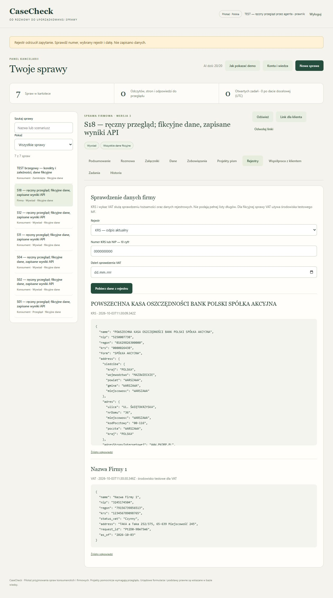

# Dodatkowy przegląd zadań i rejestrów — 3.10.2026

Po ukończeniu poprawek korekt kontynuowano ręczną pracę w aplikacji. Ten etap ujawnił dwa dalsze błędy adaptera i etykiety rejestru. Oba odtworzono testami na wcześniejszym kodzie (0/2), poprawiono i ponowiono kontrolę w interfejsie. Końcowy zestaw ma **121/121 testów** bez płatnego API.

## Zadania i etapy

W fikcyjnej sprawie brzegowej dodano zadanie administracyjne, datę 10.10.2026 i przypisano osobę z listy. Licznik wzrósł do jednego. Próba zamknięcia z otwartym zadaniem pokazała odpowiedni komunikat, etap nie zmienił się. Filtr „Otwarte zadania” pokazał jedną z siedmiu spraw.

Po oznaczeniu testowego zadania jako wykonanego licznik wrócił do zera i sprawa zniknęła z filtra. Zamknięcie udało się. Pismo pozostało zatwierdzone, z tą samą wersją danych 13. Wersja operacyjna sprawy wzrosła do 19. Ten test operacji nie oznacza ustalenia brakującego adresu w rzeczywistej sprawie.

Sprawdzono też filtr firm oraz ekran „Konta i wiedza” kontem prawnika: pokazuje źródła, pytania i akceptację wiedzy, bez formularza administracyjnego tworzenia kont. W tej próbie nie zatwierdzano wiedzy jako niezależny prawnik.

## Rejestry: rzeczywiste połączenia, bez modelu AI

| Próba | Wynik |
|---|---|
| KRS `0000000000` | Urząd zwrócił HTTP 400. Aplikacja błędnie klasyfikowała to jako niedostępność. |
| Po poprawce | Jawny `REGISTRY_QUERY_REJECTED`, polski komunikat o sprawdzeniu parametrów. Brak nowego wpisu i niezmieniona wersja sprawy. |
| KRS `0000026438` | Rzeczywisty publiczny odpis pobrał nazwę PKO Banku Polskiego, numer oraz dane siedziby. To test adaptera, nie informacja o związku banku z fikcyjną sprawą. |
| Etykieta KRS | W fikcyjnej sprawie błędnie pojawiała się etykieta środowiska VAT. Usunięto ją dla KRS, także w widoku starszych wyników. |
| MF test, NIP `3245174504` | Rzeczywiste testowe API zwróciło „Nazwa Firmy 1”, wskazany NIP, status „Czynny”, identyfikator zapytania i datę. Widok prawidłowo oznacza środowisko testowe. |

Po diagnozie nie ma podstaw do stwierdzenia, że KRS był wyłączony. Przyczyną początkowego komunikatu była błędna klasyfikacja odpowiedzi na nieprawidłowy numer. HTTP 404 pozostaje osobnym brakiem rekordu, a błąd 503 osobną niedostępnością. Nowa regresja sprawdza te trzy wyniki.

Numer publicznego podmiotu potwierdzono na [oficjalnej stronie banku](https://www.pkobp.pl/regulacje-prawne/regulamin-strony-internetowej). Źródła odpowiedzi: [API KRS](https://api-krs.ms.gov.pl/api/krs/OdpisAktualny/0000026438?rejestr=P&format=json) i [testowy wykaz MF](https://wl-test.mf.gov.pl/api/search/nip/3245174504?date=2026-10-03). Odczyt 3.10.2026. Dane banku są publiczne, materiały sprawy fikcyjne. Nie wywoływano produkcyjnego wykazu VAT ani płatnego API modelu. Limit AI pozostał 20/20.

