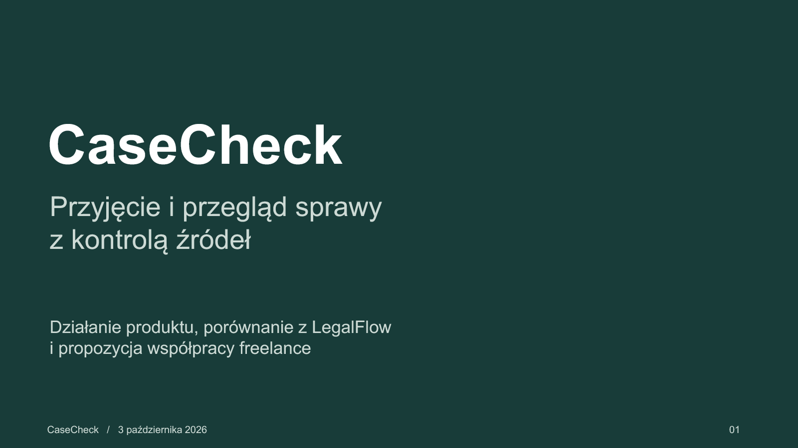

# CaseCheck — prezentacja produktu

- [Edytowalna prezentacja PowerPoint, 22 slajdy](casecheck-funkcje-porownanie-v2.pptx)
- [Podgląd PDF, 22 strony](casecheck-funkcje-porownanie.pdf)
- [Pełny zakres funkcji i dowodów](../../docs/FUNKCJE-I-WERYFIKACJA.md)
- [Szczegółowe porównanie z LegalFlow](../../docs/POROWNANIE-LEGALFLOW.md)

Slajdy opisują działanie, dostępne funkcje, przepływ danych do API, ręczne poprawki, zakres prób, ofertę konkurenta oraz propozycję współpracy freelance. Przykłady spraw są fikcyjne. Informacje o LegalFlow pochodzą z oficjalnej oferty odczytanej 3.10.2026, bez audytu ich panelu i modeli.

Tekst i sześć tabel w PPTX pozostają edytowalne. Zrzuty aplikacji są obrazami. PDF jest wizualną kopią wyrenderowanych slajdów. Sprawdzono wszystkie slajdy po eksporcie i ponownym imporcie, bez otwierania programu PowerPoint.

Źródło prezentacji: [build-presentation.mjs](../../scripts/build-presentation.mjs). Builder wymaga dołączonego runtime Presentations oraz zmiennych `RUNTIME_NODE_MODULES`, `PRESENTATIONS_SKILL_DIR`, `RUNTIME_PYTHON`. Nie wymaga kluczy API. Dla kolejnego wydania ustaw nowy `DECK_FILENAME`, ponieważ finalizator chroni istniejące pliki. PDF tworzy [render-presentation-pdf.py](../../scripts/render-presentation-pdf.py) z lokalnych renderów, używając ReportLab i Pillow.

Aktualizacja po przygotowaniu slajdów: najnowszy kod został już wdrożony na VPS. Informacja slajdu o oczekiwaniu na wdrożenie jest historyczna; [bieżący odbiór](../../docs/RECZNY-ODBIOR-VPS.md) opisuje aktualizację oraz nadal oczekujące przeniesienie domeny.
